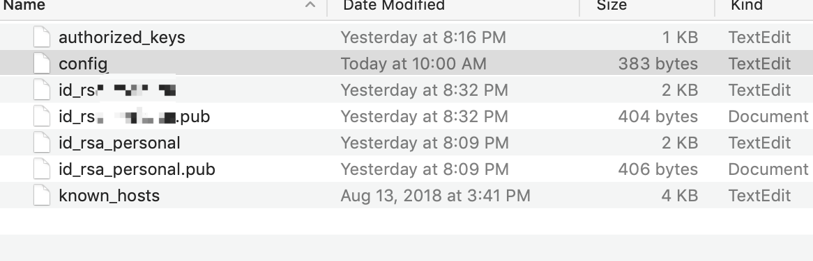
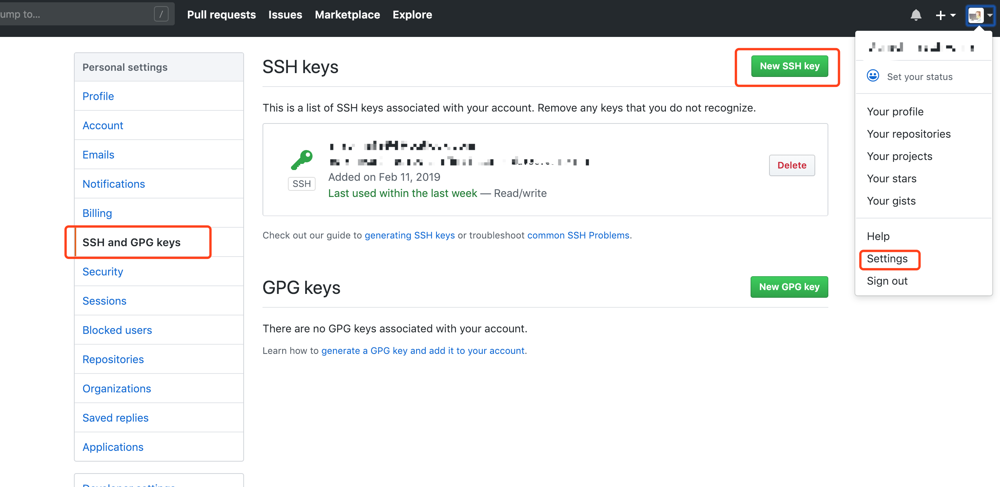

> 前言

如果你有以下这种需求，那么请继续读下去     

    1. 有两个 github 账号，并且是在同一台电脑上进行维护的
    2. 私人 github 账号，公司 gitlab 之类的账号
    

> 要达到在 Mac 客户端下管理多个账号，总共需要这么 6 步

### 1. 清除 git 的全局设置 	

如果对 git 设置过 user.name 和 user.email，类似这种设置	
<pre>
$ git config --global user.name "your_email_prefix"		
$ git config --global user.email "your_email"
</pre>	

那么，首先必须删除该设置，不然会有冲突。	

取消全局设置的方法：		
<pre>
$ git config --global --unset user.name "your_email_prefix"			
$ git config --global --unset user.email "your_email"
</pre>

### 2. 生成新的 SSH keys

生成 ssh keys 命令：		
<pre>$ ssh-keygen -t rsa -C "your_email"</pre>

一般直接默认生成 id_rsa 和 id_rsa_pub，就可以了。		
**但是**多个 git 账户不行		

*注意*⚠️ 	
多个 git 账户需要输入与默认配置不一样的文件名	

	
举个🌰，可以是 id\_rsa\_personal 和 id\_rsa\_worker

查看生成的 ssh keys		

**🌹方法一**

<pre>$ open ~/.ssh</pre>	

**🌹方法二**
<pre>
$ cd ~/.ssh.  	
$ ls -l  
cat id_rsa_personal.pub
</pre>

ssh keys 生成完毕

### 3. 添加并识别新的 SSH keys 私钥

默认只读取 id_rsa，为了让 SSH 识别新的私钥，需要添加到 SSH agent 中

Mac 客户端操作命令如下	

<pre>$ ssh-add -K ~/.ssh/id_rsa_personal</pre>

比如说分别需要添加 id\_rsa\_personal 和 id\_rsa\_worker。

### 4. 添加新的 SSH keys 到 Git 账号的 SSH 设置中

将新生成的公钥 id\_rsa\_\*.pub 添加到对应的 SSH key 中			
		
*复制公钥*

<pre>$ pbcopy < ~/.ssh/id_rsa_*.pub</pre>

*添加 SSH Key 到 Git 账户设置中*

例如：Github 网站设置，在 Setting => SSH and GPG keys

### 5. 配置 ~/.ssh/config 文件
如果没有 config 文件，创建 config 文件，命令如下
<pre>$ touch ~/.ssh/config</pre>

**配置 config 信息**
<pre>
#Default gitHub user(personal@email.com)
 Host git@github.com
 HostName https://github.com
 User git
 IdentityFile ~/.ssh/id_rsa_personal
######################################
#Add gitLab user(worker@****.com)
 Host git@git.****.com
 HostName https://git.****.com
 User git
 IdentityFile ~/.ssh/id_rsa_worker
</pre>

### 6. 验证连接 Git
链接 Git 命令：
<pre>
$ ssh -T git@github.com
Hi zhaolina! You've successfully authenticated, but GitHub does not provide shell access.
# 上面是 github 连接成功返回语句

$ ssh -T git@xxxx.com
Wolcome to GitLab, zhaolina!
# 上面是 gitLab 连接成功返回语句
</pre>

其他 Git 仓库返回语句可自行考量，如果还是不能连接成功的话，尝试
<pre>$ ssh -vT git@github.com  # 查看出错信息</pre> 

> 可能遇到的问题				

1. Permission denied（Publickey) 

	原因：私钥和公钥不匹配		
	解决方式及排查点：
	
	
		1. 是否将公钥配置到对应的网站去了
		2. 是否将私钥添加到 ssh_agent 了
		3. 如果都检查没有问题，那么有可能你的 ssh_agent 需要清除并重新添加了

		清除 ssh_agent 的命令：
		$ ssh-add -D  # 清除所有的 key-pair
		$ ssh-add -K ~/.ssh/id_rsa_* # 重新添加

	
